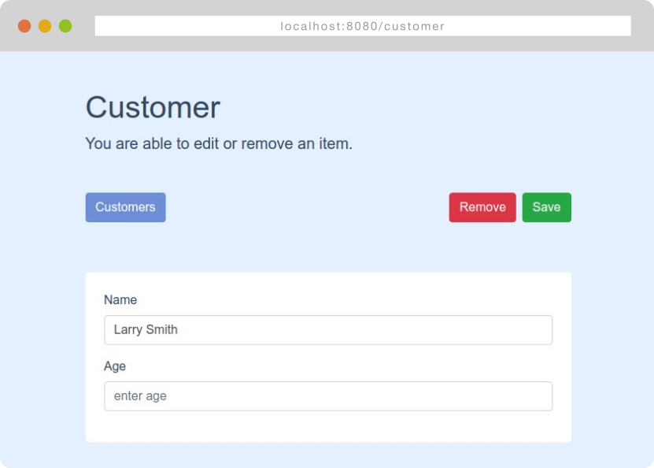

<br/>
<a href="https://github.com/mikeevstropov/vuex-loopback">
<div align="center">
  
</div>
</a>
<br/>

## Installing

##### 1. Clone `loopback-example-relations` and start api-server.
```
git clone https://github.com/strongloop/loopback-example-relations.git
cd loopback-example-relations
yarn install
yarn start
```

##### 2. Clone `vuex-loopback-example` and start web-server.
```
git clone https://github.com/mikeevstropov/vuex-loopback-example.git
cd vuex-loopback-example
yarn install
yarn serve
```

##### 3. Go to http://localhost:8080/

<br/>
<div align="center">
  
</div>
<br/>
<div align="center">
  
</div>
<br/>
<div align="center">
  
</div>
<br/>
